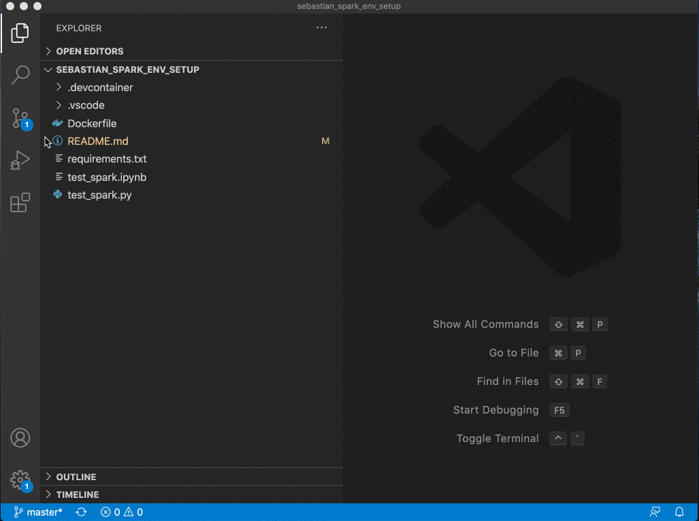

# pyspark-env-setup

> Set-up PySpark Environment with Docker Containers


---

## Table of Contents (Optional)

- [Installation](#installation)
- [Support](#support)


## Installation

> Windows Machine
- [Install VS Code](https://code.visualstudio.com/download)
- [Install Docker Desktop Windows](https://hub.docker.com/editions/community/docker-ce-desktop-windows)
    - Try installing Get Edge if there are pre-requisite issues
- Install Containers 
    - save below as InstallContainer.bat file and run

```bash
pushd "%~dp0"
dir /b %SystemRoot%\servicing\Packages\*containers*.mum >containers.txt
for /f %%i in ('findstr /i . containers.txt 2^>nul') do dism /online /norestart /add-package:"%SystemRoot%\servicing\Packages\%%i"
del containers.txt
dism /online /enable-feature /featurename:Containers -All /LimitAccess /ALL
pause
```

- Install Hyper-V 
    - save below as InstallHyperV.bat file and run
```bash
pushd "%~dp0"
dir /b %SystemRoot%\servicing\Packages\*Hyper-V*.mum >hyper-v.txt
for /f %%i in ('findstr /i . hyper-v.txt 2^>nul') do dism /online /norestart /add-package:"%SystemRoot%\servicing\Packages\%%i"
del hyper-v.txt
dism /online /enable-feature /featurename:Microsoft-Hyper-V -All /LimitAccess /ALL
pause
```
						
<p>Windows Subsystem for Linux has two different versions to choose between during the installation process. WSL 2 has better overall performance and we recommend using it. If your system does not support WSL 2, or you have a specific situation that requires cross-system file storage, then you may want to stick with WSL 1. Read more about <a href="compare-versions" data-linktype="relative-path">Comparing WSL 2 and WSL 1</a>.</p>
<h2 id="step-1---enable-the-windows-subsystem-for-linux" class="heading-anchor"><a class="anchor-link docon docon-link" href="#step-1---enable-the-windows-subsystem-for-linux" aria-labelledby="step-1---enable-the-windows-subsystem-for-linux"></a>Step 1 - Enable the Windows Subsystem for Linux</h2>
<p>You must first enable the "Windows Subsystem for Linux" optional feature before installing any Linux distributions on Windows.</p>
<p>Open PowerShell as Administrator and run:</p>
<div class="codeHeader" id="code-try-0" data-bi-name="code-header"><span class="language">PowerShell</span><button type="button" class="action is-relative" data-bi-name="copy" aria-label="Copy code">
				<span class="icon">
					<span class="docon docon-edit-copy" role="presentation"></span>
				</span>
				<span>Copy</span>
				<div class="successful-copy-alert is-absolute has-right-zero has-top-zero has-left-zero has-bottom-zero is-flex has-flex-align-items-center has-flex-justify-content-center has-text-success-invert has-background-success is-transparent" aria-hidden="true">
					<span class="icon is-size-large">
						<span class="docon docon-check-mark" role="presentation"></span>
					</span>
				</div>
			</button></div><pre tabindex="0" class="has-inner-focus"><code class="lang-powershell" data-author-content="dism.exe /online /enable-feature /featurename:Microsoft-Windows-Subsystem-Linux /all /norestart
"><span>dism.exe /online /<span class="hljs-pscommand">enable-feature</span> /featurename:<span class="hljs-pscommand">Microsoft-Windows</span>-<span class="hljs-pscommand">Subsystem-Linux</span> /all /norestart
</span></code></pre>
<h2 id="step-2---update-to-wsl-2" class="heading-anchor"><a class="anchor-link docon docon-link" href="#step-2---update-to-wsl-2" aria-labelledby="step-2---update-to-wsl-2"></a>Step 2 - Update to WSL 2</h2>
<p>To update to WSL 2, you must be running Windows 10.</p>
<h3 id="requirements" class="heading-anchor"><a class="anchor-link docon docon-link" href="#requirements" aria-labelledby="requirements"></a>Requirements</h3>
<ul>
<li>For x64 systems: <strong>Version 1903</strong> or higher, with <strong>Build 18362</strong> or higher.</li>
<li>For ARM64 systems: <strong>Version 2004</strong> or higher, with <strong>Build 19041</strong> or higher.</li>
<li>Builds lower than 18362 do not support WSL 2. Use the <a href="https://www.microsoft.com/software-download/windows10" data-linktype="external">Windows Update Assistant</a> to update your version of Windows.</li>
</ul>
<p>To check your version and build number, select <strong>Windows logo key + R</strong>, type <strong>winver</strong>, select <strong>OK</strong>. (Or enter the <code>ver</code> command in Windows Command Prompt). <a href="ms-settings:windowsupdate" data-linktype="external">Update to the latest Windows version</a> in the Settings menu.</p>
<div class="alert is-info">
<p class="alert-title"><span class="docon docon-status-error-outline" aria-hidden="true"></span> Note</p>
<p>If you are running Windows 10 version 1903 or 1909, open "Settings" from your Windows menu, navigate to "Update &amp; Security" and select "Check for Updates". Your Build number must be 18362.1049+ or 18363.1049+, with the minor build # over .1049. Read more: <a href="https://devblogs.microsoft.com/commandline/wsl-2-support-is-coming-to-windows-10-versions-1903-and-1909/" data-linktype="external">WSL 2 Support is coming to Windows 10 Versions 1903 and 1909</a>. See the <a href="troubleshooting#im-on-windows-10-version-1903-and-i-still-do-not-see-options-for-wsl-2" data-linktype="relative-path">troubleshooting instructions</a>.</p>
</div>
<h2 id="step-3---enable-virtual-machine-feature" class="heading-anchor"><a class="anchor-link docon docon-link" href="#step-3---enable-virtual-machine-feature" aria-labelledby="step-3---enable-virtual-machine-feature"></a>Step 3 - Enable Virtual Machine feature</h2>
<p>Before installing WSL 2, you must enable the <strong>Virtual Machine Platform</strong> optional feature.</p>
<p>Open PowerShell as Administrator and run:</p>
<div class="codeHeader" id="code-try-1" data-bi-name="code-header"><span class="language">PowerShell</span><button type="button" class="action is-relative" data-bi-name="copy" aria-label="Copy code">
				<span class="icon">
					<span class="docon docon-edit-copy" role="presentation"></span>
				</span>
				<span>Copy</span>
				<div class="successful-copy-alert is-absolute has-right-zero has-top-zero has-left-zero has-bottom-zero is-flex has-flex-align-items-center has-flex-justify-content-center has-text-success-invert has-background-success is-transparent" aria-hidden="true">
					<span class="icon is-size-large">
						<span class="docon docon-check-mark" role="presentation"></span>
					</span>
				</div>
			</button></div><pre tabindex="0" class="has-inner-focus"><code class="lang-powershell" data-author-content="dism.exe /online /enable-feature /featurename:VirtualMachinePlatform /all /norestart
"><span>dism.exe /online /<span class="hljs-pscommand">enable-feature</span> /featurename:VirtualMachinePlatform /all /norestart
</span></code></pre>
<p><strong>Restart</strong> your machine to complete the WSL install and update to WSL 2.</p>
<h2 id="step-4---download-the-linux-kernel-update-package" class="heading-anchor"><a class="anchor-link docon docon-link" href="#step-4---download-the-linux-kernel-update-package" aria-labelledby="step-4---download-the-linux-kernel-update-package"></a>Step 4 - Download the Linux kernel update package</h2>
<ol>
<li><p>Download the latest package:</p>
<ul>
<li><a href="https://wslstorestorage.blob.core.windows.net/wslblob/wsl_update_x64.msi" data-linktype="external">WSL2 Linux kernel update package for x64 machines</a></li>
</ul>
<div class="alert is-info">
<p class="alert-title"><span class="docon docon-status-error-outline" aria-hidden="true"></span> Note</p>
<p>If you're using an ARM64 machine, please download the <a href="https://wslstorestorage.blob.core.windows.net/wslblob/wsl_update_arm64.msi" data-linktype="external">ARM64 package</a> instead. If you're not sure what kind of machine you have, open Command Prompt or PowerShell and enter: <code>systeminfo | find "System Type"</code>.</p>
</div>
</li>
<li><p>Run the update package downloaded in the previous step. (Double-click to run - you will be prompted for elevated permissions, select ‘yes’ to approve this installation.)</p>
</li>
</ol>
<p>Once the installation is complete, move on to the next step - setting WSL 2 as your default version when installing new Linux distributions. (Skip this step if you want your new Linux installs to be set to WSL 1).</p>
<div class="alert is-info">
<p class="alert-title"><span class="docon docon-status-error-outline" aria-hidden="true"></span> Note</p>
<p>For more information, read the article <a href="https://devblogs.microsoft.com/commandline/wsl2-will-be-generally-available-in-windows-10-version-2004" data-linktype="external">changes to updating the WSL2 Linux kernel</a>, available on the <a href="https://aka.ms/cliblog" data-linktype="external">Windows Command Line Blog</a>.</p>
</div>
<h2 id="step-5---set-wsl-2-as-your-default-version" class="heading-anchor"><a class="anchor-link docon docon-link" href="#step-5---set-wsl-2-as-your-default-version" aria-labelledby="step-5---set-wsl-2-as-your-default-version"></a>Step 5 - Set WSL 2 as your default version</h2>
<p>Open PowerShell as Administrator and run this command to set WSL 2 as the default version when installing a new Linux distribution:</p>
<div class="codeHeader" id="code-try-2" data-bi-name="code-header"><span class="language">PowerShell</span><button type="button" class="action is-relative" data-bi-name="copy" aria-label="Copy code">
				<span class="icon">
					<span class="docon docon-edit-copy" role="presentation"></span>
				</span>
				<span>Copy</span>
				<div class="successful-copy-alert is-absolute has-right-zero has-top-zero has-left-zero has-bottom-zero is-flex has-flex-align-items-center has-flex-justify-content-center has-text-success-invert has-background-success is-transparent" aria-hidden="true">
					<span class="icon is-size-large">
						<span class="docon docon-check-mark" role="presentation"></span>
					</span>
				</div>
			</button></div><pre tabindex="0" class="has-inner-focus"><code class="lang-powershell" data-author-content="wsl --set-default-version 2
"><span>wsl<span class="hljs-parameter"> --set-default-version</span> <span class="hljs-number">2</span>
</span></code></pre>
<div class="alert is-info">


> Mac Machine
- [Install VS Code](https://code.visualstudio.com/download)
- [Install Docker Desktop Mac](https://hub.docker.com/editions/community/docker-ce-desktop-mac/)

---
## How to start

**Open VS code and Clone this repository**



---

## Support

Reach out to me at one of the following places!

 <svg aria-hidden="true" class="global-nav__logo" xmlns="http://www.w3.org/2000/svg" width="34" height="34" data-supported-dps="34x34" focusable="false"><g transform="scale(.7083)" fill="none" fill-rule="evenodd"><rect class="bug-text-color" fill="#FFF" x="1" y="1" width="46" height="46" rx="4">
</rect><path d="M0 4.01A4.01 4.01 0 014.01 0h39.98A4.01 4.01 0 0148 4.01v39.98A4.01 4.01 0 0143.99 48H4.01A4.01 4.01 0 010 43.99V4.01zM19 18.3h6.5v3.266C26.437 19.688 28.838 18 32.445 18 39.359 18 41 21.738 41 28.597V41.3h-7V30.159c0-3.906-.937-6.109-3.32-6.109-3.305 0-4.68 2.375-4.68 6.109V41.3h-7v-23zM7 41h7V18H7v23zm8-30.5a4.5 4.5 0 11-9 0 4.5 4.5 0 019 0z" class="background" fill="#0077B5"></path></g></svg> <a href="https://www.linkedin.com/in/sebastian-srikanth/">`Sebastian LinkedIN`</a>

---
